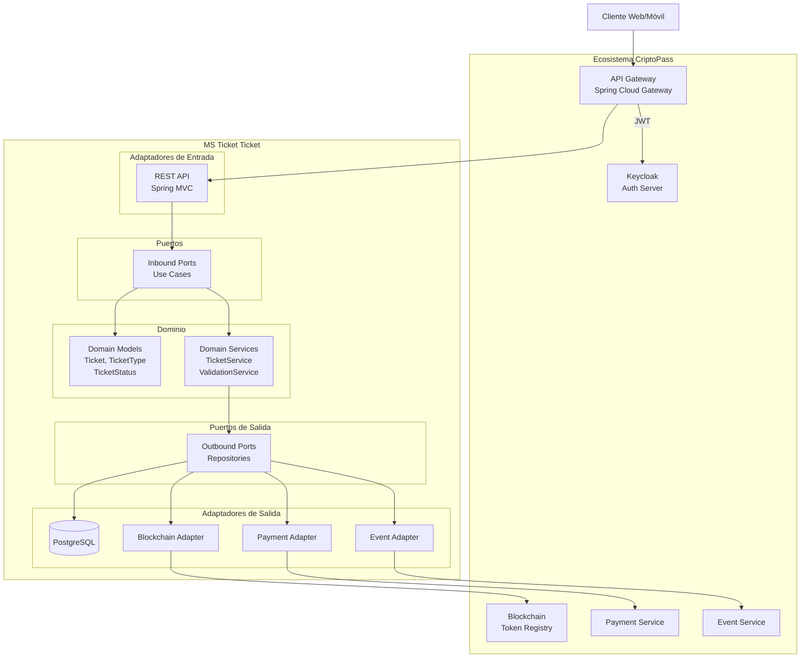
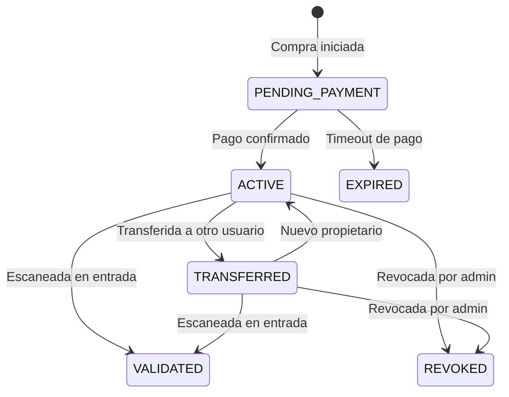

# CriptoPass MS Ticket Ticket

## Status: implemented

Microservicio de gestión de boletas para el portal de venta de boletas en línea **CriptoPass**.

## Descripción

Este microservicio es responsable de la gestión completa del ciclo de vida de las boletas digitales dentro del ecosistema CriptoPass. Proporciona APIs para la compra, consulta, transferencia, validación y revocación de boletas, con integración a blockchain para garantizar la autenticidad y trazabilidad de cada ticket.

## Stack Tecnológico

| Tecnología | Versión | Propósito |
|---|---|---|
| Kotlin | 2.2.21 | Lenguaje principal |
| Spring Boot | 4.0.6 | Framework de aplicación |
| Gradle | 8.14+ | Build tool |
| Keycloak | - | Autenticación OAuth2/OIDC |
| PostgreSQL | - | Base de datos relacional |
| Flyway | - | Migraciones de base de datos |
| OpenAPI 3.1 | - | Contrato de API |
| Docker | - | Contenedorización |

## Arquitectura

El microservicio sigue los principios de **Arquitectura Hexagonal** (Puertos y Adaptadores) dentro de un ecosistema de microservicios:



## Estructura del Proyecto

```
criptopass-ms-ticket-ticket/
├── docs/
│   ├── api/
│   │   └── openapi.yaml          # Contrato OpenAPI 3.1
│   ├── keycloak/                  # Configuración de roles/clients
│   └── specs/                     # Especificaciones SDD
├── src/
│   ├── main/
│   │   ├── kotlin/
│   │   │   └── com/criptopass/ms/ticket/ticket/
│   │   │       └── TicketApplication.kt
│   │   └── resources/
│   │       └── application.yaml
│   └── test/
│       └── kotlin/
├── build.gradle
├── settings.gradle
└── README.md
```

## Endpoints de la API

Base path: `/ms-ticket-ticket/v1`

### Endpoints Públicos

| Método | Path | Descripción |
|---|---|---|
| `GET` | `/ticket-types` | Listar tipos de boleta de un evento |

### Endpoints de Cliente (requiere autenticación)

| Método | Path | Descripción |
|---|---|---|
| `GET` | `/tickets` | Listar mis boletas (paginado) |
| `GET` | `/tickets/{ticketId}` | Obtener detalle de boleta |
| `GET` | `/tickets/{ticketId}/qr` | Obtener QR de la boleta |
| `POST` | `/tickets/{ticketId}/transfer` | Transferir boleta a otro usuario |
| `POST` | `/ticket-types/{ticketTypeId}/purchase` | Comprar boleta (genera orden de pago) |

### Endpoints Administrativos (requiere rol ADMIN/ORGANIZER)

| Método | Path | Descripción |
|---|---|---|
| `POST` | `/tickets/{ticketId}/revoke` | Revocar boleta (reembolsos) |
| `GET` | `/tickets/events/{eventId}` | Listar boletas de un evento |

### Endpoints de Validación (requiere rol ADMIN/ORGANIZER)

| Método | Path | Descripción |
|---|---|---|
| `POST` | `/validation/scan` | Escanear y validar boleta por QR |
| `POST` | `/validation/{ticketId}` | Validar boleta por ID |

## Modelo de Datos

### Estados de una Boleta (`TicketStatus`)



### Esquema de Boleta

| Campo | Tipo | Descripción |
|---|---|---|
| `id` | `Long` | Identificador único |
| `event` | `EventSummary` | Resumen del evento asociado |
| `ticket_type` | `TicketTypeResponse` | Tipo de boleta |
| `owner_id` | `Long` | ID del propietario |
| `owner_email` | `String` | Email del propietario |
| `price` | `Double` | Precio pagado |
| `status` | `TicketStatus` | Estado actual |
| `qr_code` | `String` | Código QR único |
| `blockchain_token_id` | `Long` | Token ID en blockchain |
| `blockchain_tx_hash` | `String` | Hash de transacción blockchain |
| `seat_number` | `String` | Número de asiento (opcional) |
| `purchased_at` | `DateTime` | Fecha de compra |
| `validated_at` | `DateTime` | Fecha de validación |
| `created_at` | `DateTime` | Fecha de creación |
| `updated_at` | `DateTime` | Fecha de actualización |

## Roles y Permisos

| Rol | Acceso |
|---|---|
| **Sin rol (público)** | Consultar tipos de boleta |
| **CUSTOMER** (autenticado) | Gestionar sus propias boletas |
| **ADMIN** | Revocar boletas, listar boletas de evento, validar boletas |
| **ORGANIZER** | Revocar boletas, listar boletas de evento, validar boletas |

## Integraciones

| Servicio | Protocolo | Propósito |
|---|---|---|
| **Keycloak** | OAuth2/OIDC | Autenticación y autorización |
| **Payment Service** | REST | Procesamiento de pagos |
| **Event Service** | REST | Consulta de datos de eventos |
| **Blockchain** | REST/RPC | Registro de tokens de boletas |

## Inicio Rápido

### Prerrequisitos

- JDK 21+
- Gradle 8.14+
- Docker y Docker Compose
- PostgreSQL 16+
- Keycloak (para desarrollo local)

### Ejecución Local

```bash
# 1. Clonar el repositorio
git clone <repo-url>
cd criptopass-ms-ticket-ticket

# 2. Configurar variables de entorno
cp .env.example .env
# Editar .env con los valores correctos

# 3. Iniciar dependencias (PostgreSQL, Keycloak)
docker compose up -d

# 4. Ejecutar migraciones
./gradlew flywayMigrate

# 5. Compilar y ejecutar
./gradlew bootRun
```

### Ejecutar Tests

```bash
# Tests unitarios
./gradlew test

# Tests de integración
./gradlew integrationTest

# Coverage
./gradlew jacocoTestReport
```

### Construir para Producción

```bash
./gradlew bootJar
```

## Estado de Implementación

El microservicio ha sido implementado siguiendo la Arquitectura Hexagonal con las siguientes capas:

| Fase | Estado |
|------|--------|
| Configuración del Proyecto | ✅ Implementado |
| Modelos de Dominio | ✅ Implementado |
| Excepciones de Dominio | ✅ Implementado |
| Puertos (Interfaces) | ✅ Implementado |
| Adaptadores de Salida | ✅ Implementado |
| Servicios de Aplicación | ✅ Implementado |
| Controladores REST | ✅ Implementado |
| Seguridad y Configuración | ✅ Implementado |
| Migraciones Flyway | ✅ Implementado |
| DTOs y Mappers | ✅ Implementado |
| QR Code | ✅ Implementado |
| Tests | ✅ Implementado |

**Commit**: Ver task board para detalle de cada tarea.

## Documentación Adicional

- [Guía de Arquitectura](docs/architecture.md)
- [Guía de Despliegue](docs/deployment.md)
- [Guía de API](docs/api-guide.md)
- [Contrato OpenAPI](docs/api/openapi.yaml)

## Licencia

Proprietary - UNLICENSED
