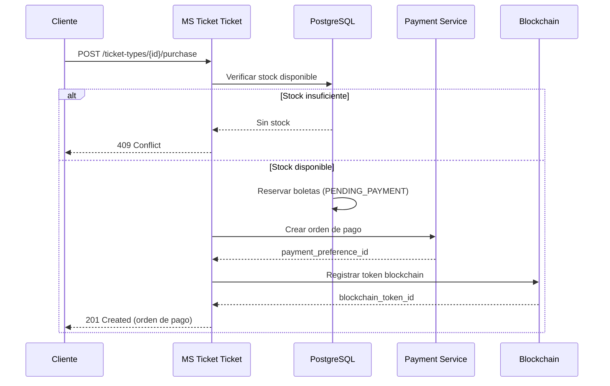

# Guía de API - CriptoPass MS Ticket Ticket

## Información General

- **Base URL**: `/ms-ticket-ticket/v1`
- **Formato**: JSON
- **Autenticación**: Bearer JWT (Keycloak OAuth2/OIDC)
- **Contrato completo**: [openapi.yaml](./api/openapi.yaml)

## Autenticación

Todos los endpoints protegidos requieren un token JWT válido en el header `Authorization`:

```http
Authorization: Bearer <access_token>
```

El token debe ser emitido por Keycloak y contener los roles necesarios según el endpoint.

### Obtener Token (Desarrollo)

```bash
curl -X POST http://localhost:8080/realms/criptopass/protocol/openid-connect/token \
  -d "grant_type=password" \
  -d "client_id=ms-ticket-ticket" \
  -d "client_secret=<secret>" \
  -d "username=usuario@email.com" \
  -d "password=<password>"
```

## Respuestas de Error

Todos los errores siguen un formato estandarizado:

```json
{
  "timestamp": "2026-05-15T10:30:00Z",
  "status": 400,
  "error": "BAD_REQUEST",
  "code": "TICKET_VALIDATION_ERROR",
  "message": "La boleta no se encuentra en estado activo",
  "path": "/ms-ticket-ticket/v1/tickets/123/transfer",
  "trace_id": "abc-123-def-456",
  "details": [
    {
      "field": "ticketId",
      "code": "INVALID_STATUS",
      "message": "La boleta está en estado REVOKED",
      "rejected_value": "123"
    }
  ]
}
```

### Códigos de Error Comunes

| Código HTTP | Causa | Acción |
|---|---|---|
| `400` | Validación fallida | Revisar campo `details` |
| `401` | Token ausente o inválido | Re-autenticar |
| `403` | Sin permisos | Verificar roles en Keycloak |
| `404` | Recurso no encontrado | Verificar ID |
| `409` | Conflicto de estado | La boleta ya fue usada/revocada |
| `500` | Error interno | Contactar soporte con `trace_id` |

---

## Endpoints Públicos

### Listar Tipos de Boleta

Consulta los tipos de boleta disponibles para un evento.

```http
GET /ticket-types?event_id={eventId}
```

**Parámetros:**

| Parámetro | Tipo | Requerido | Descripción |
|---|---|---|---|
| `event_id` | `integer (int64)` | Sí | ID del evento |

**Respuesta 200:**

```json
[
  {
    "id": 1,
    "event_id": 100,
    "name": "General",
    "description": "Entrada general sin asiento asignado",
    "price": 50.00,
    "quantity": 500,
    "available_quantity": 342,
    "max_per_user": 5,
    "created_at": "2026-04-01T00:00:00Z"
  },
  {
    "id": 2,
    "event_id": 100,
    "name": "VIP",
    "description": "Acceso VIP con asiento preferencial",
    "price": 150.00,
    "quantity": 50,
    "available_quantity": 12,
    "max_per_user": 2,
    "created_at": "2026-04-01T00:00:00Z"
  }
]
```

**Respuesta 404:**

```json
{
  "timestamp": "2026-05-15T10:30:00Z",
  "status": 404,
  "error": "NOT_FOUND",
  "code": "EVENT_NOT_FOUND",
  "message": "El evento con ID 999 no existe",
  "path": "/ms-ticket-ticket/v1/ticket-types",
  "trace_id": "xyz-789",
  "details": []
}
```

---

## Endpoints de Cliente

### Listar Mis Boletas

Retorna las boletas compradas por el usuario autenticado.

```http
GET /tickets?page=0&size=20&status=ACTIVE&event_id=100
```

**Parámetros de Query:**

| Parámetro | Tipo | Default | Descripción |
|---|---|---|---|
| `page` | `integer` | `0` | Número de página |
| `size` | `integer` | `20` | Tamaño de página |
| `status` | `TicketStatus` | - | Filtrar por estado |
| `event_id` | `integer (int64)` | - | Filtrar por evento |

**Estados válidos**: `PENDING_PAYMENT`, `ACTIVE`, `TRANSFERRED`, `VALIDATED`, `REVOKED`, `EXPIRED`

**Respuesta 200:**

```json
{
  "content": [
    {
      "id": 1001,
      "event": {
        "id": 100,
        "name": "Concierto Rock 2026",
        "start_date": "2026-08-15T20:00:00Z",
        "venue_name": "Estadio Nacional"
      },
      "ticket_type": {
        "id": 1,
        "event_id": 100,
        "name": "General",
        "description": "Entrada general",
        "price": 50.00,
        "quantity": 500,
        "available_quantity": 342,
        "max_per_user": 5,
        "created_at": "2026-04-01T00:00:00Z"
      },
      "owner_id": 42,
      "owner_email": "usuario@email.com",
      "price": 50.00,
      "status": "ACTIVE",
      "qr_code": "QR-abc123def456",
      "blockchain_token_id": 78901,
      "blockchain_tx_hash": "0x1a2b3c4d5e6f...",
      "seat_number": null,
      "purchased_at": "2026-05-01T14:30:00Z",
      "validated_at": null,
      "created_at": "2026-05-01T14:30:00Z",
      "updated_at": "2026-05-01T14:30:00Z"
    }
  ],
  "page": 0,
  "size": 20,
  "total_elements": 1,
  "total_pages": 1
}
```

### Obtener Detalle de Boleta

```http
GET /tickets/{ticketId}
```

**Requisito**: El usuario debe ser el propietario o tener rol ADMIN.

**Respuesta 200:** Ver esquema `TicketResponse` arriba.

**Respuesta 403:**

```json
{
  "timestamp": "2026-05-15T10:30:00Z",
  "status": 403,
  "error": "FORBIDDEN",
  "code": "TICKET_NOT_OWNED",
  "message": "No tienes permiso para ver esta boleta",
  "path": "/ms-ticket-ticket/v1/tickets/9999",
  "trace_id": "err-403",
  "details": []
}
```

### Obtener QR de la Boleta

```http
GET /tickets/{ticketId}/qr
```

**Respuesta 200:**

```json
{
  "ticket_id": 1001,
  "qr_code": "QR-abc123def456",
  "qr_image_url": "https://cdn.criptopass.com/qr/1001.png",
  "expires_at": "2026-05-15T10:35:00Z"
}
```

**Nota**: El QR code es de corta duración (TTL configurable, default 5 minutos). El campo `expires_at` indica cuándo expira este QR específico, no la boleta. Para obtener un QR nuevo, se debe repetir la llamada a este endpoint. La boleta en sí es válida hasta la fecha del evento.

### Comprar Boleta

Inicia el proceso de compra generando una orden de pago.

```http
POST /ticket-types/{ticketTypeId}/purchase
Content-Type: application/json

{
  "quantity": 2
}
```

**Restricciones:**
- `quantity`: mínimo 1, máximo 10
- El usuario debe estar autenticado
- Debe haber stock disponible

**Respuesta 201:**

```json
{
  "order_id": "ORD-2026051501-abc123",
  "ticket_type_id": 1,
  "quantity": 2,
  "total_amount": 100.00,
  "payment_preference_id": "pref_abc123",
  "status": "PENDING_PAYMENT",
  "created_at": "2026-05-15T10:30:00Z"
}
```

**Respuesta 409 (sin stock):**

```json
{
  "timestamp": "2026-05-15T10:30:00Z",
  "status": 409,
  "error": "CONFLICT",
  "code": "INSUFFICIENT_TICKETS",
  "message": "Solo quedan 1 boletas disponibles",
  "path": "/ms-ticket-ticket/v1/ticket-types/1/purchase",
  "trace_id": "err-409",
  "details": []
}
```

### Transferir Boleta

Transfiere la propiedad de una boleta a otro usuario registrado.

```http
POST /tickets/{ticketId}/transfer
Content-Type: application/json

{
  "recipient_email": "nuevo.dueno@email.com"
}
```

**Requisitos:**
- El usuario debe ser el propietario actual
- La boleta debe estar en estado `ACTIVE` o `TRANSFERRED`
- El destinatario debe existir en el sistema

**Respuesta 200:**

```json
{
  "id": 1001,
  "event": {
    "id": 100,
    "name": "Concierto Rock 2026",
    "start_date": "2026-08-15T20:00:00Z",
    "venue_name": "Estadio Nacional"
  },
  "ticket_type": {
    "id": 1,
    "event_id": 100,
    "name": "General",
    "description": "Entrada general",
    "price": 50.00,
    "quantity": 500,
    "available_quantity": 342,
    "max_per_user": 5,
    "created_at": "2026-04-01T00:00:00Z"
  },
  "owner_id": 99,
  "owner_email": "nuevo.dueno@email.com",
  "price": 50.00,
  "status": "ACTIVE",
  "qr_code": "QR-new789xyz",
  "blockchain_token_id": 78901,
  "blockchain_tx_hash": "0x9f8e7d6c5b4a...",
  "seat_number": null,
  "purchased_at": "2026-05-01T14:30:00Z",
  "validated_at": null,
  "created_at": "2026-05-01T14:30:00Z",
  "updated_at": "2026-05-15T10:30:00Z"
}
```

---

## Endpoints Administrativos

### Revocar Boleta

Revoca una boleta para procesamiento de reembolso.

```http
POST /tickets/{ticketId}/revoke
```

**Requisito**: Rol `ADMIN` o `ORGANIZER`.

**Respuesta 200:** Boleta con estado `REVOKED`.

### Listar Boletas de un Evento

```http
GET /tickets/events/{eventId}?page=0&size=20&status=ACTIVE
```

**Requisito**: Rol `ADMIN` o `ORGANIZER`.

**Respuesta 200:** Lista paginada de `TicketResponse`.

---

## Endpoints de Validación

### Escanear Boleta por QR

Valida una boleta escaneando su código QR en la entrada del evento.

```http
POST /validation/scan
Content-Type: application/json

{
  "qr_code": "QR-abc123def456"
}
```

**Requisito**: Rol `ADMIN` o `ORGANIZER`.

**Respuesta 200 (válida):**

```json
{
  "valid": true,
  "ticket": {
    "id": 1001,
    "status": "VALIDATED",
    "validated_at": "2026-08-15T19:45:00Z"
  },
  "message": "Boleta validada exitosamente",
  "validated_at": "2026-08-15T19:45:00Z",
  "validated_by": 55
}
```

**Respuesta 409 (ya usada):**

```json
{
  "timestamp": "2026-08-15T19:45:00Z",
  "status": 409,
  "error": "CONFLICT",
  "code": "TICKET_ALREADY_VALIDATED",
  "message": "Esta boleta ya fue validada anteriormente",
  "path": "/ms-ticket-ticket/v1/validation/scan",
  "trace_id": "err-409-scan",
  "details": [
    {
      "field": "qr_code",
      "code": "ALREADY_USED",
      "message": "La boleta fue validada el 2026-08-15T19:30:00Z",
      "rejected_value": "QR-abc123def456"
    }
  ]
}
```

### Validar Boleta por ID

```http
POST /validation/{ticketId}
```

**Requisito**: Rol `ADMIN` o `ORGANIZER`.

Misma respuesta que `/validation/scan` pero buscando por ID en lugar de QR.

---

## Diagrama de Flujo de Compra



## Paginación

Todos los endpoints que retornan listas soportan paginación:

**Request:**
```
GET /tickets?page=0&size=20
```

**Response:**
```json
{
  "content": [...],
  "page": 0,
  "size": 20,
  "total_elements": 150,
  "total_pages": 8
}
```

## Rate Limiting

Los endpoints están sujetos a límites de tasa configurados en el API Gateway:

| Endpoint | Límite |
|---|---|
| `/ticket-types` | 100 req/min |
| `/tickets` | 60 req/min |
| `/ticket-types/{id}/purchase` | 10 req/min |
| `/validation/scan` | 30 req/min |
