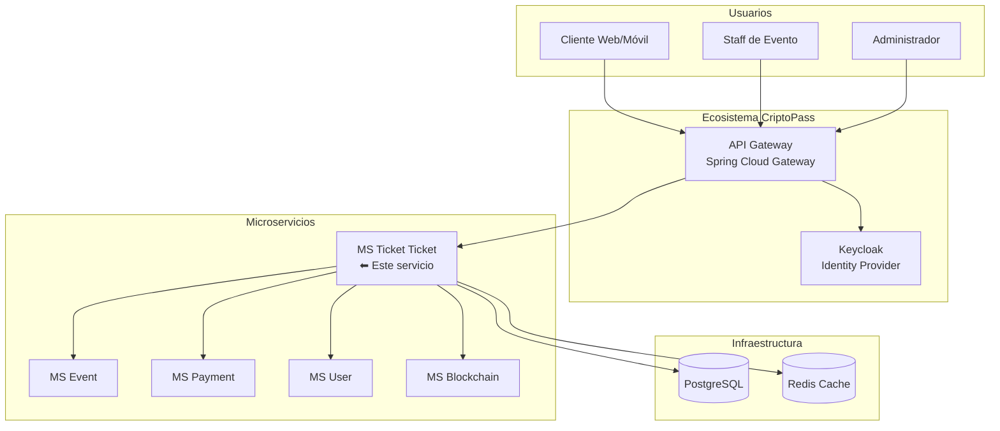
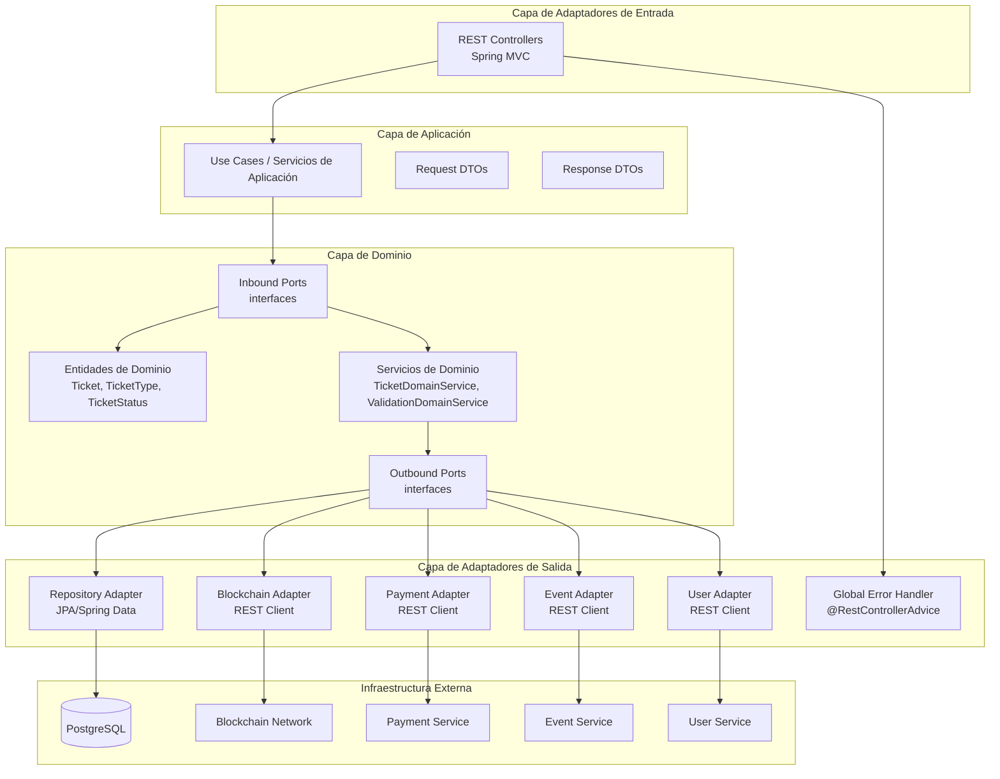
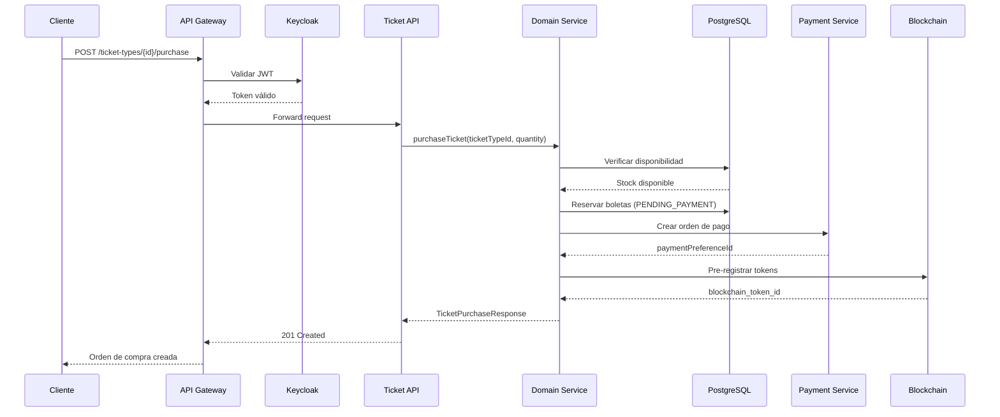
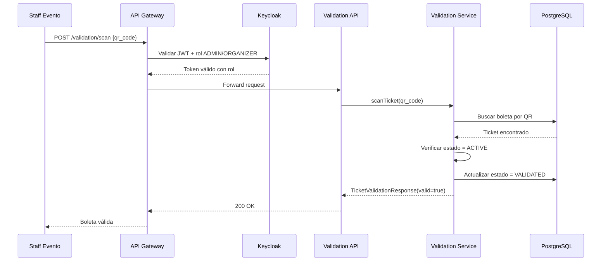
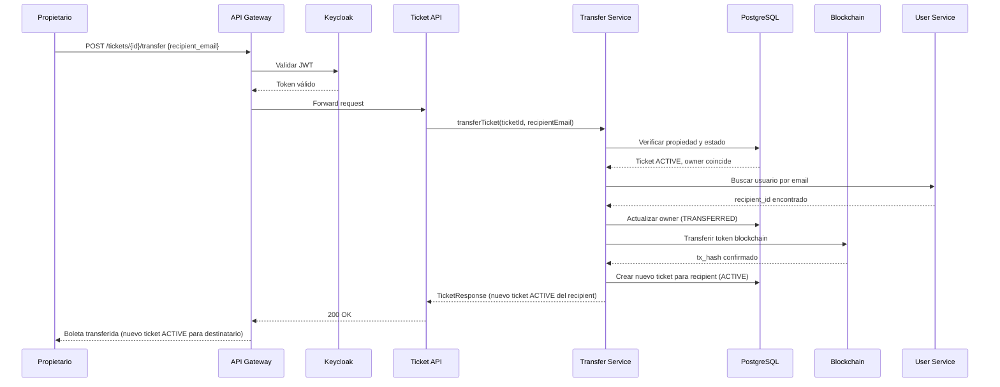
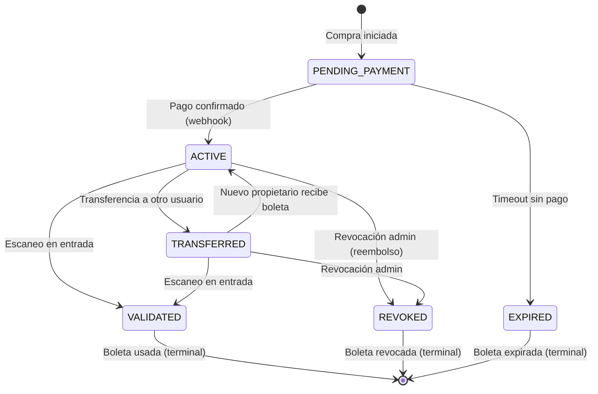

# Arquitectura - CriptoPass MS Ticket Ticket

## Visión General

Microservicio responsable de la gestión del ciclo de vida completo de boletas digitales dentro del ecosistema CriptoPass. Maneja desde la compra hasta la validación en entrada, incluyendo transferencia entre usuarios y revocación administrativa.

## Contexto del Sistema (Modelo C4 - Nivel 1)



## Arquitectura Interna (Nivel 3 - Hexagonal)



## Paquetes Propuestos

```
com.criptopass.ms.ticket.ticket
├── adapter/
│   ├── in/                          # Adaptadores de entrada
│   │   ├── rest/                    # Controllers REST
│   │   │   ├── TicketController.kt
│   │   │   ├── TicketTypeController.kt
│   │   │   └── ValidationController.kt
│   │   └── security/                # Filtros de seguridad
│   │       └── JwtAuthenticationFilter.kt
│   └── out/                         # Adaptadores de salida
│       ├── persistence/             # Repositorios JPA
│       │   ├── TicketRepository.kt
│       │   └── TicketTypeRepository.kt
│       ├── blockchain/              # Cliente blockchain
│       │   └── BlockchainClient.kt
│       ├── payment/                 # Cliente de pagos
│       │   └── PaymentClient.kt
│       ├── event/                   # Cliente de eventos
│       │   └── EventClient.kt
│       └── user/                    # Cliente de usuarios
│           └── UserClient.kt
├── application/
│   ├── service/                     # Servicios de aplicación
│   │   ├── TicketService.kt
│   │   ├── TicketPurchaseService.kt
│   │   ├── TicketTransferService.kt
│   │   └── TicketValidationService.kt
│   ├── port/
│   │   ├── in/                      # Puertos de entrada (interfaces)
│   │   │   ├── ListTicketsUseCase.kt
│   │   │   ├── PurchaseTicketUseCase.kt
│   │   │   ├── TransferTicketUseCase.kt
│   │   │   └── ValidateTicketUseCase.kt
│   │   └── out/                     # Puertos de salida (interfaces)
│   │       ├── TicketRepositoryPort.kt
│   │       ├── BlockchainPort.kt
│   │       ├── PaymentPort.kt
│   │       ├── EventPort.kt
│   │       └── UserPort.kt
│   └── dto/                         # DTOs de aplicación
│       ├── request/
│       └── response/
├── domain/
│   ├── model/                       # Entidades de dominio
│   │   ├── Ticket.kt
│   │   ├── TicketType.kt
│   │   ├── TicketStatus.kt
│   │   └── EventSummary.kt
│   ├── exception/                   # Excepciones de dominio
│   │   ├── TicketNotFoundException.kt
│   │   ├── TicketNotOwnedByUserException.kt
│   │   ├── TicketAlreadyValidatedException.kt
│   │   └── InsufficientTicketsException.kt
│   └── service/                     # Lógica de dominio pura
│       └── TicketDomainService.kt
└── config/                          # Configuración
    ├── SecurityConfig.kt
    ├── OpenApiConfig.kt
    └── ApplicationConfig.kt
```

## Flujos Principales

### 1. Compra de Boleta



### 2. Validación de Boleta en Entrada



### 3. Transferencia de Boleta



## Modelo de Estados de Boleta



## Seguridad

### Autenticación
- **Proveedor**: Keycloak (OAuth2 / OIDC)
- **Mecanismo**: Bearer JWT en header `Authorization`
- **Validación**: Verificación de firma, expiración y claims en API Gateway

### Autorización (RBAC)

| Endpoint | Roles Requeridos |
|---|---|
| `GET /ticket-types` | Público |
| `GET /tickets` | Cualquier usuario autenticado |
| `GET /tickets/{id}` | Owner o ADMIN |
| `GET /tickets/{id}/qr` | Owner o ADMIN |
| `POST /tickets/{id}/transfer` | Owner |
| `POST /ticket-types/{id}/purchase` | Cualquier usuario autenticado |
| `POST /tickets/{id}/revoke` | ADMIN, ORGANIZER |
| `GET /tickets/events/{id}` | ADMIN, ORGANIZER |
| `POST /validation/scan` | ADMIN, ORGANIZER |
| `POST /validation/{id}` | ADMIN, ORGANIZER |

### Protección de Datos
- Los tokens blockchain y hashes de transacción son inmutables
- Los QR codes tienen expiración configurable
- Los logs no deben incluir datos sensibles (emails completos, tokens)

## Escalabilidad

### Consideraciones
- **Lectura intensiva**: Los endpoints de consulta de boletas son los más frecuentes
- **Picos de carga**: Compra masiva al abrir venta de eventos populares
- **Validación concurrente**: Múltiples scanners en entrada de eventos grandes

### Estrategias
- Cache de tipos de boleta y resúmenes de evento (Redis)
- Paginación en todos los listados
- Validación optimista de stock con retry
- Índices en `owner_id`, `event_id`, `qr_code`, `status`

## Observabilidad

### Métricas Clave
| Métrica | Tipo | Alerta |
|---|---|---|
| `tickets.purchase.count` | Counter | Caída > 50% vs baseline |
| `tickets.validation.count` | Counter | - |
| `tickets.validation.failure_rate` | Gauge | > 5% |
| `tickets.transfer.count` | Counter | - |
| `tickets.blockchain.tx_latency` | Histogram | p99 > 5s |
| `tickets.payment.order.count` | Counter | - |
| `http.requests.duration` | Histogram | p99 > 2s |

### Logs Estructurados
- Formato JSON con `trace_id`, `span_id`, `user_id`, `ticket_id`
- Niveles: INFO para operaciones normales, WARN para reintentos, ERROR para fallos

### Health Checks
- `/actuator/health` - Estado general
- `/actuator/health/db` - Conexión PostgreSQL
- `/actuator/health/blockchain` - Conectividad blockchain
- `/actuator/health/payment` - Conectividad payment service
